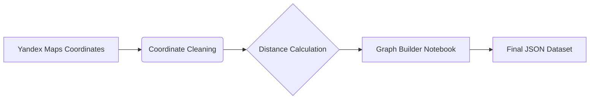

# Traveling Salesman Problem (TSP) Solver: Comparing Nature-Inspired Algorithms 🐜🧬

[](https://opensource.org/licenses/MIT)
[](https://www.python.org/)

An optimized implementation and comparative analysis of **Ant Colony Optimization (ACO)** and **Genetic Algorithms (GA)** for solving TSP, benchmarked against **Dynamic Programming (DP)**. Designed for real-world urban navigation using Innopolis city data.

## 📖 Table of Contents
- [Key Features](#-key-features)
- [Algorithms Overview](#-algorithms-overview)
- [Dataset & Preprocessing](#-dataset--preprocessing)
- [Installation](#-installation)
- [Usage](#-usage)
- [Testing & Metrics](#-testing--metrics)
- [Results](#-results)
- [Roadmap](#-roadmap)
- [Contributing](#-contributing)
- [Team](#-team)
- [License](#-license)

---

## 🚀 Key Features
- **Real-World Urban Dataset**: 36 key locations in Innopolis city with precise coordinates
- **Algorithm Comparison**:
  - 🐜 **ACO**: Pheromone-based path optimization
  - 🧬 **GA**: Evolutionary approach with tournament selection
  - ⚡ **DP**: Exact solution baseline (up to 15 nodes)
- **Performance Metrics**:
  - Execution time ⏱️
  - Memory consumption 💾
  - Solution accuracy 🎯

---

## 📊 Algorithms Overview

| Algorithm  | Optimality | Best For |
|-----------|------------|----------|
| DP        | Exact      | Small graphs (<15 nodes) |
| ACO       | Heuristic | Medium graphs (15-20 nodes) |
| GA        | Heuristic | Large graphs (20+ nodes) |

---

## 🌍 Dataset & Preprocessing
**Cities**: 36 buildings in Innopolis, Russia  
**Data Sources**:
- Coordinates collected via Yandex Maps
- Distance matrix calculated using GeoPy module

**Preprocessing Pipeline**:


📁 **Dataset Files**:
- `data/nodes.json`: Node coordinates
- `data/graph.json`: Complete distance matrix

[▶️ View Preprocessing Code](utils/graph_builder.ipynb)

---

## ⚙️ Installation
1. Clone repository:
   ```bash
   git clone https://github.com/LowIQCoder/NIC_Project
   cd NIC_Project
   ```
2. Install dependencies:
   ```bash
   pip install -r requirements.txt
   ```

---

## 🖥️ Usage
**Run All Algorithms**:
```python
python main.py
```

## 🧪 Testing & Metrics
**Evaluation Protocol**:
1. **Correctness Check**: Validate against DP results (n ≤ 22)
2. **Performance Benchmark**:
   - Time: Maximum 60 minutes per algorithm instance
   - Memory: Peak usage tracking
   - Convergence: Iterations to stable solution

**Termination Criteria**:
```python
if execution_time > 3600:
    terminate_algorithm()
elif iterations > 1000:
    terminate_algorithm()
```

---

## 📈 Results
**Sample Output (GA on 36 nodes)**:
```text
✅ Test #35 ============================ GA ===
Graph Size:          36
Execution Time:      894.21s  
Iterations:          1278
Memory Usage:        58.7 MB
Path Length:         14.2 km
Optimal Path:        0 → 12 → 5 → ... → 22 → 0
```

---

## 🗺️ Roadmap
- **Completed**:
  - ✔️ Dataset collection & validation
  - ✔️ Core algorithm implementations
  - ✔️ Performance benchmarking

- **In Progress**:
  - 🏁 Preparing to final presentation

- **Future Work**:
  - 🌐 Interactive web visualization
  - 📊 Convergence analysis dashboard
  - 🧠 Add Particle Swarm Optimization
  - 🌍 Multi-city dataset expansion

---

## 👥 Team
| Member                  | Role                          | Contribution |
|-------------------------|-------------------------------|--------------|
| Marsel Berheev (Team Lead) | Algorithm Design              | DP Core, System Architecture |
| Nikita Stepankov        | Optimization Specialist       | ACO Implementation |
| Makar Egorov            | Evolutionary Computing Expert | GA Development |

**Contacts**:
- m.berheeev@innopolis.university
- n.stepankov@innopolis.university
- m.egorov@innopolis.university 

---

## 📜 License
This project is licensed under the MIT License - see the [LICENSE](LICENSE) file for details.

**Innopolis University** 2025
