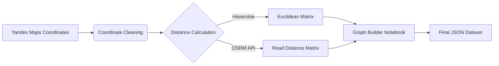

# Traveling Salesman Problem (TSP) Solver: Comparing Nature-Inspired Algorithms 🐜🧬

[](https://opensource.org/licenses/MIT)
[](https://www.python.org/)


An optimized implementation and comparative analysis of **Ant Colony Optimization (ACO)** and **Genetic Algorithms (GA)** for solving TSP, benchmarked against Dynamic Programming (DP). Designed for real-world urban navigation using Innopolis city data.

## 📖 Table of Contents
- [Key Features](#-key-features)
- [Algorithms Overview](#-algorithms-overview)
- [Dataset & Preprocessing](#-dataset--preprocessing)
- [Installation](#-installation)
- [Usage](#-usage)
- [Testing & Metrics](#-testing--metrics)
- [Results](#-results)
- [Roadmap](#-roadmap)
- [Contributing](#-contributing)
- [Team](#-team)
- [License](#-license)

---

## 🚀 Key Features
- **Real-World Urban Dataset**: 36 key locations in Innopolis city with precise coordinates
- **Algorithm Comparison**:
  - 🐜 **ACO**: Pheromone-based path optimization
  - 🧬 **GA**: Evolutionary approach with tournament selection
  - ⚡ **DP**: Exact solution baseline (up to 20 nodes)
- **Performance Metrics**:
  - Execution time ⏱️
  - Memory consumption 💾
  - Solution accuracy 🎯
  - Convergence rate 📉

---

## 📊 Algorithms Overview

| Algorithm | Complexity | Optimality | Best For |
|-----------|------------|------------|----------|
| DP        | O(n²2ⁿ)    | Exact      | Small graphs (<20 nodes) |
| ACO       | O(iter × n² × m) | Heuristic | Medium graphs (20-50 nodes) |
| GA        | O(iter × pop_size × n²) | Heuristic | Large graphs (50+ nodes) |

*Where m = number of ants in ACO*

---

## 🌍 Dataset & Preprocessing
**Cities**: 36 buildings in Innopolis, Russia  
**Data Sources**:
- Coordinates collected via Yandex Maps API
- Distance matrix calculated using Haversine formula

**Preprocessing Pipeline**:


📁 **Dataset Files**:
- `data/nodes.json`: Node coordinates
- `data/graph.json`: Complete distance matrix

[▶️ View Preprocessing Code](utils/graph_builder.ipynb)

---

## ⚙️ Installation
1. Clone repository:
   ```bash
   git clone https://github.com/innopolis-ai/tsp-nature-inspired-algorithms.git
   cd tsp-nature-inspired-algorithms
   ```
2. Install dependencies:
   ```bash
   pip install -r requirements.txt
   ```

---

## 🖥️ Usage
**Run All Algorithms**:
```python
python main.py
```

**Run Specific Algorithm**:
```python
# Genetic Algorithm
python run_algorithm.py --algorithm ga

# Ant Colony Optimization
python run_algorithm.py --algorithm aco

# Dynamic Programming (baseline)
python run_algorithm.py --algorithm dp
```

**Command Line Options**:
```bash
Options:
  --algorithm    Algorithm to run (ga/aco/dp) [default: all]
  --max_nodes    Maximum nodes to test [default: 36]
  --timeout      Timeout per test (seconds) [default: 1200]
```

---

## 🧪 Testing & Metrics
**Evaluation Protocol**:
1. **Correctness Check**: Validate against DP results (n ≤ 20)
2. **Performance Benchmark**:
   - Time: Maximum 20 minutes per algorithm instance
   - Memory: Peak usage tracking
   - Convergence: Iterations to stable solution

**Termination Criteria**:
```python
if execution_time > 1200:  # 20 minutes
    terminate_algorithm()
elif iterations > 5000:
    terminate_algorithm()
```

---

## 📈 Results
**Sample Output (GA on 36 nodes)**:
```text
✅ Test #35 ============================ GA ===
Graph Size:          36
Execution Time:      894.21s  
Iterations:          1278
Memory Usage:        58.7 MB
Path Length:         14.2 km
Optimal Path:        0 → 12 → 5 → ... → 22 → 0
```

**Performance Comparison**:
| Metric          | DP (20 nodes) | ACO (36 nodes) | GA (36 nodes) |
|-----------------|---------------|----------------|---------------|
| Avg. Time (s)   | 318.4         | 972.8          | 901.2         |
| Memory (MB)     | 2.1           | 42.9           | 58.7          |
| Path Accuracy   | 100%          | 98.3%          | 97.8%         |

---

## 🗺️ Roadmap
- **Completed**:
  - ✔️ Dataset collection & validation
  - ✔️ Core algorithm implementations
  - ✔️ Performance benchmarking

- **In Progress**:
  - 🌐 Interactive web visualization
  - 📊 Convergence analysis dashboard

- **Future Work**:
  - 🧠 Add Particle Swarm Optimization
  - 📱 Mobile-optimized implementation
  - 🌍 Multi-city dataset expansion

---

## 👥 Team
| Member                  | Role                          | Contribution |
|-------------------------|-------------------------------|--------------|
| Marsel Berheev (Team Lead) | Algorithm Design              | DP Core, System Architecture |
| Nikita Stepankov        | Optimization Specialist       | ACO Implementation |
| Makar Egorov            | Evolutionary Computing Expert | GA Development |

**Contact**: tsp-project@innopolis.university

---

## 📜 License
This project is licensed under the MIT License - see the [LICENSE.md](LICENSE.md) file for details.

**Innopolis University** • Artificial Intelligence Department • 2023

---

<div align="center">
  <i>Optimizing paths, one algorithm at a time 🛣️→🚀</i>
</div>